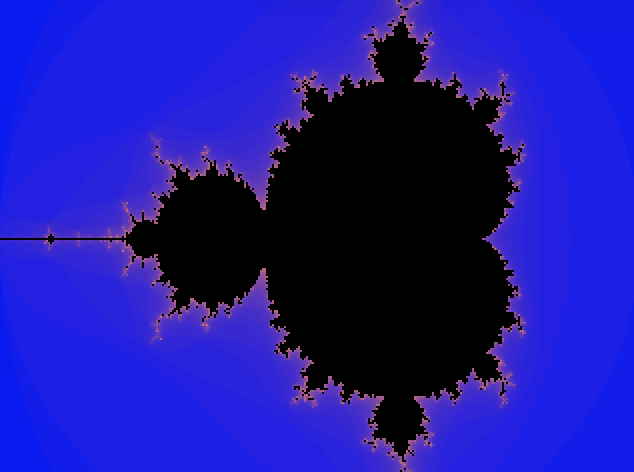

# Kyr Compiler

**Kyr** is a compiled, statically-typed language designed for high-performance execution on the **MIPS architecture**. This project features a complete compiler pipeline built with **Java**, **JFlex**, and **CUP**, capable of generating assembly from complex recursive algorithms.

---

## Key Features (Kyr4)

- **Functions & Recursion**: Full support for functions with multiple parameters, local variables, and deep recursion (Stack Frame management).
- **Control Flow**: `si / alors / sinon` (if/then/else) and `repeter / jusqua` (repeat/until) loops.
- **Strong Typing**: Semantic analysis for `entier` (integer) and `booleen` (boolean).
- **MIPS Code Generation**:
    - **Automatic Stack Frame allocation**: Standard management of `$fp` and `$ra` for nested calls.
    - **Optimized register usage**: Efficient expression evaluation using the MIPS register set.
    - **Global variable persistence**: Shared access to global data via `$s7`.
- **Graphics Support**: Capable of generating standard **PPM (Portable Pixmap)** images through standard output (e.g., fractal generation).

---

## Case Study: Mandelbrot Fractal

The compiler is powerful enough to process complex recursive logic. The following example generates a 320x240 Mandelbrot set in PPM format.

**Kyr Source Code (`mandel.kyr`):**
```kyr
variables
    entier width entier height entier x entier y entier val
fonctions
    entier mandel(entier zr, entier zi, entier cr_in, entier ci_in, entier iter)
    variables
        entier zr2 entier zi2 entier dist2
    debut
        si iter > 30 alors retourne iter; finsi
        zr2 = (zr * zr) / 2048;
        zi2 = (zi * zi) / 2048;
        dist2 = zr2 + zi2;
        si dist2 > 8192 alors retourne iter; finsi
        retourne mandel(zr2 - zi2 + cr_in, (2 * zr * zi) / 2048 + ci_in, cr_in, ci_in, iter + 1);
    fin
debut
    width = 320; height = 240;
    ecrire "P3\n"; ecrire width; ecrire " "; ecrire height; ecrire "\n255\n";
    y = 0;
    repeter
        x = 0;
        repeter
            val = mandel(0, 0, (x*3*2048)/width - 4096, (y*2*2048)/height - 2048, 0);
            si val > 25 alors ecrire "0 0 0 ";
            sinon ecrire val*8; ecrire " "; ecrire val*4; ecrire " "; ecrire 255-(val*5); ecrire " ";
            finsi
            x = x + 1;
        jusqua x >= width;
        y = y + 1;
    jusqua y >= height;
fin    
```

**Generated MIPS Assembly (Extract):**

The following MIPS code is automatically generated by the **Kyr** compiler for the Mandelbrot header and global variable initialization. Notice the use of `$s7` as a static frame pointer to ensure global variables remain accessible even during deep recursion.

```mips
.data
    vrai: .asciiz "vrai"
    faux: .asciiz "faux"
    uniqueLabel0: .asciiz "P3\n"
    uniqueLabel1: .asciiz " "
    uniqueLabel2: .asciiz "\n255\n"
    # ... additional labels for pixels ...

.text
main:
    move $fp, $sp             # Initialize frame pointer
    move $s7, $sp             # Save initial SP into $s7 for global access
    subi $sp, $sp, 32         # Allocate 32 bytes (8 global variables)
    
    # width = 320
    li $v0, 320
    sw $v0, -4($s7)           # Store in global memory (offset -4)

    # ecrire "P3\n"
    la $v0, uniqueLabel0      # Load address of the PPM header string
    move $a0, $v0
    li $v0, 4                 # Syscall 4: print_string
    syscall

    # ecrire width
    lw $v0, -4($s7)           # Load width from global storage
    move $a0, $v0
    li $v0, 1                 # Syscall 1: print_int
    syscall
    
    {...}
```

**Resulting Output:**



---

##  Build & Execution Pipeline

1. **Generate MIPS**:
   Compile your Kyr source code into MIPS assembly.
   ```bash
   java -jar kyr4.jar mandel.kyr
   ```
2. **Execute via Mars**:
   Run the generated assembly using the Mars simulator and redirect the standard output to a PPM file.
   ```bash
   java -jar Mars.jar nc mandel.mips > fractal.ppm
   ```
   
3. **View**:
   Open the resulting fractal.ppm with any image viewer (like GIMP, Photoshop, or a standard Netpbm viewer).

   On macOS, you can quickly view it from your terminal:
    ```bash
   open fractal.ppm
   ```

--- 


## Project Structure
```
.
├── kyr/
│   ├── ast/                # Abstract Syntax Tree (Declarations, Expressions, Statements)
│   ├── parser/             # CUP Grammar & generated Parser/Symbols
│   ├── scanner/            # JFlex Lexical rules
│   ├── symtable/           # Scoped Symbol Table (Global/Local stack handling)
│   └── exceptions/         # Compiler error management
├── ext/                    # External tools (JFlex, CUP, MARS)
└── tests/                  # Test suites (Kyr0 to Kyr4)
```

**Technologies:**
- **Lexical Analysis:** JFlex
- **Syntax Analysis:** JavaCup
- **Code Generation:** MIPS assembly
- **Target Architecture:** MIPS processor

---

##  Semantic Analysis & Checks

The semantic analysis is the **"brain"** of the **Kyr** compiler. It ensures that the source code, while syntactically correct, follows the logical rules of the language. This phase is handled by the **AST nodes** in conjunction with a **Scoped Symbol Table**.

### 1. Scope & Symbol Management
The compiler uses a stack-based **Symbol Table** to manage nested scopes (Global vs. Local):
* **Variable Declaration**: Ensures no variable is declared twice within the same scope.
* **Variable Resolution**: When a variable is referenced, the compiler searches from the innermost (local) scope to the outermost (global) scope.
* **Function Registration**: Functions are stored with their **Arity** (number of parameters) to support consistency checks and handle function calls correctly.

### 2. Type Checking (Strict Typing)
Kyr enforces strict type compatibility to prevent runtime errors in MIPS:
* **Assignments**: A variable of type `entier` cannot be assigned a `booleen` value, and vice versa.
* **Binary Operations**: Arithmetic operators (`+`, `-`, `*`, `/`) require two integers. Logical operators (`et`, `ou`) require two booleans.
* **Comparisons**: Relational operators (`>`, `<`, `==`, etc.) compare two integers but return a `booleen`.

### 3. Function & Control Flow Integrity
With the implementation of **Kyr4**, the semantic layer handles complex function logic:
* **Arity Matching**: Every function call must provide the exact number of arguments defined in the function's signature.
* **Return Type Validation**: The expression returned by a `retourne` statement must match the function's declared return type.
* **Mandatory Return**: The compiler verifies that a function contains a return statement (Static analysis).
* **Context Awareness**: Prevents the use of `retourne` outside of a function body (e.g., in the global `debut...fin` block).

### 4. Memory Offset Calculation
During this phase, the compiler assigns specific memory locations:
* **Global Offsets**: Calculated relative to the static base `$s7`.
* **Local Offsets**: Calculated within the **Stack Frame**, accounting for the saved `$fp` and `$ra` (Return Address).


--- 

## Usage

1. Write your Kyr source code with `.kyr` extension
2. Compile using the Kyr compiler:
```bash
   java -jar kyr1.jar program.kyr
```
3. If compilation succeeds, a `program.mips` file is generated
4. Run the generated MIPS assembly in a simulator (MARS, SPIM, QtSpim)

---

##  Compilation & Testing

The project uses a **Makefile** to automate the build, JAR packaging, and testing process.

### Build the entire project
This generates the Parser, Lexer, and bundles everything into a runnable JAR file:
```bash
make
```
### Run tests

Run the test suite for a specific milestone (e.g., Kyr4):
```bash
make tests TARGET=kyr4
```
### Clean the environment

Remove all build artifacts and generated Java files to start fresh:
```bash
make clean
```

---

##  Error Messages

The **Kyr** compiler provides precise feedback during each phase of the compilation process. It produces one of the following outputs:

* ✅ **`COMPILATION OK`**: The source code is valid, and the MIPS assembly has been generated successfully.
* ❌ **`ERREUR LEXICALE : line X : message`**: An invalid token or character was encountered (handled by **JFlex**).
* ❌ **`ERREUR SYNTAXIQUE : line X : message`**: The code violates the language grammar (handled by **CUP**).
* ❌ **`ERREUR SEMANTIQUE : line X : message`**: Logical errors such as type mismatches, undeclared variables, or scope violations.

---

##  Requirements

To build and run the **Kyr** compiler, ensure you have the following installed:

* **Java JDK 11+**: Necessary for compiling the Java source files and running the JAR.
* **Mars 4.5 Mips Simulator**: Included in the `ext/` directory of this project.

---
*Developed as part of the **Compiler Design** course — **University of Lorraine**.*


